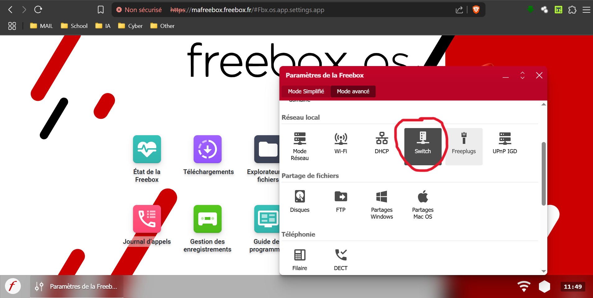

# Freebox Remote Web

## Présentation

Ce projet propose une interface web simple permettant de contrôler un décodeur **Freebox Player** via le réseau local, en utilisant l’API HTTP intégrée à la Freebox.  
L’utilisateur peut ainsi remplacer la télécommande physique par une télécommande virtuelle accessible depuis un navigateur web.

---

## Objectifs

- Fournir une alternative fonctionnelle à la télécommande Freebox
- Expérimenter l’interaction réseau entre machines sur un LAN
- Illustrer un projet web complet avec interface HTML, serveur Flask et interaction avec des équipements tiers via API HTTP

---

## Fonctionnalités

- Interface web responsive simulant une télécommande
- Commandes de base : navigation (`up`, `down`, `left`, `right`, `ok`)
- Commandes multimédia : volume, mute, power (veille/allumage)
- Requêtes HTTP générées dynamiquement à partir des actions utilisateur

---

## Prérequis

- **Python 3.10 ou supérieur**
- Connexion locale au même réseau que le Freebox Player
- Code de la télécommande Freebox (généré par le décodeur)
- IP locale du Freebox Player

---

## Configuration

### 1. Récupérer l’adresse IP du Freebox Player

#### Méthode recommandée :

- Aller sur l’interface Freebox OS ([mafreebox.freebox.fr](http://mafreebox.freebox.fr))
- Accéder à la rubrique **Switch** dans **les paramètres de la Freebox**
- Identifier le Freebox Player par son **adresse MAC** ou son **nom**

> Exemple d’identification depuis Freebox OS :
> 
> 

#### Si l'IP n’est pas visible via `arp -a` :

La commande `arp -a` permet d’afficher la table ARP, qui associe les adresses IP aux adresses MAC connues par votre machine.  
Elle est utile **après avoir trouvé l’adresse MAC du Freebox Player** via l’interface Freebox OS :

```bash
arp -a

# Exemple avec `nmap` :
nmap -sn 192.168.0.0/24
```

- Ou, sur Windows, utiliser un outil graphique comme **Advanced IP Scanner**.

📌 **Par défaut**, l’IP du Player est souvent `192.168.0.2`.

---

### 2. Récupérer le code de la télécommande

Sur la télévision (via le Player) :

- Aller dans **Paramètres → Système → Télécommande Freebox**
- Noter le code à 8 chiffres affiché (ex : `55984265`)

🎬 **Vidéo explicative** :


---

### 3. Modifier le fichier `app.py`

Ouvrez le fichier `app.py` et remplacez :

- `REMOTE_CODE = "VOTRE_CODE_ICI"` par votre code télécommande
- `FREEBOX_IP = "192.168.X.X"` par l’adresse IP trouvée précédemment

---

## Installation

1. **Cloner le dépôt** :
   ```bash
   git clone https://github.com/nom-utilisateur/freebox-remote-web.git
   cd freebox-remote-web
   ```

2. **Installer les dépendances** :
   ```bash
   pip install flask requests
   ```

3. **Lancer le serveur** :
   ```bash
   python app.py
   ```

4. **Accéder à l’interface** :
   [http://localhost:5000](http://localhost:5000)

---

## Structure du projet

```
freebox-remote-web/
├── app.py              # Serveur Flask
├── static/
│   └── style.css       # Styles de l’interface
├── templates/
│   └── index.html      # Interface utilisateur
├── images/             # Captures d’écran utilisées dans le README
├── telec.mp4           # Vidéo de démonstration pour récupérer le code
└── README.md
```

---

## Exemple de requête envoyée

Chaque bouton de la télécommande web génère une requête de la forme :
```
http://<IP_FREEBOX>/pub/remote_control?code=<CODE_TEL>&key=<TOUCHE>
```

Exemple pour augmenter le volume :
```
http://192.168.0.2/pub/remote_control?code=55984265&key=vol_up
```

🎬 **Vidéo Démonstration** :


---

## Limitations connues

- Certains codes (`return`, `guide`) ne sont pas fonctionnels selon les versions du firmware Freebox.
- Le comportement du bouton `power` dépend du contexte (veille ou allumage).
- Le code de télécommande et l’adresse IP peuvent varier selon le matériel.

---

## Cas d’usage

- Projet de domotique local
- Présentation pédagogique sur les APIs réseau et Flask
- Substitution d’une télécommande physique défaillante
- Démonstration de communication client-serveur sur un réseau local

---

## Auteurs

Projet réalisé par **Sonny**  
Date : Avril 2025
